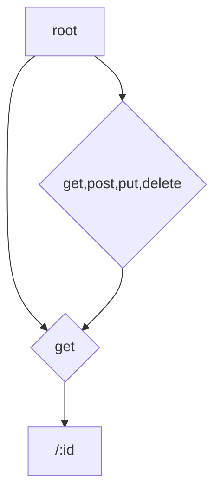

> **Warning**: this project is still under heavy development and should not be considered ready for usage!
> both the api and underlying implementation are subject to change
# Muxillary
It's the dumbest pun I could think of.

Muxillary is a simple http route parser and multiplexer.

It aims to integrate seamlessly with the golang http package, while providing functionality missing in the standard library.

# Quickstart
## Installation 
`go get github.com/Sibo9436/muxillary`

## Usage

# Ideas
Secondo me potrebbe essere divertente implementarlo utilizzando una struttura ad albero
Ad esempio per la route POST:/cavalli/proprietari avrei:


```
root
|
|-----/cavalli
|        |
|        |
|        |---- /proprietari{post:http.HandlerFunc,delete:http.HandlerFunc}
|
|-----/proprietari{get:handler}
        |
        |---/:id{handler}

```

In questo modo, quando vado a popolare i miei endpoints se trovo un endpoint che potrebbe creare un conflitto posso andare in errore gioiosamente

## Todo 
Per adesso siamo riusciti a superare un test molto basilare
Bisogna andare a vedere un pochino come ci aspettiamo essere una specifica decente per come gestire i path parameters 

Oltre ai path parameters devo anche trovare un modo decente per parsare i query parameters e schiantarli in una mappa, perché mi sa che golang
di suo non lo fa

La cosa più importante sarà poi fare dei benchmark e capire se e come modificare il sistema dei path per evitare problemi di scaling

Per la questione performance allo stato attuale non so bene quanto pesi il fatto di avere degli oggetti interi per il path

Importante sarà poi gestire le collisioni tra path!!

Nel frattempo mi stanno venendo in mente altre diciottomila idee per creare un sistema più simile a quello ad esempio di SpringBoot 
ma in realtà non ha molto senso visto che l'idea principale è mantenere un mux che sia perfettamente compatibile con il pacchetto http
e che sia il meno ingombrante possibile

Tra le cose da fare devo poter mettere come minimo la possibilità di definire una funzione che restituisca un 404 customizzato, non dovrebbe essere difficile


